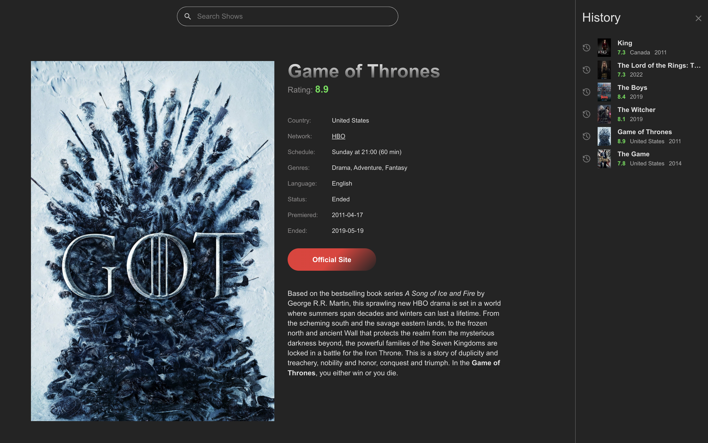

# Showgle - TV Show Search App

## Overview

Showgle is an application designed for searching TV shows using the [TVMaze API](https://www.tvmaze.com/api). Users can search for TV shows by name, view detailed information about each show, and keep track of their search history. The application is fully responsive and works on all screen sizes.

## Live Demo

Check the [Live Demo](https://ark-web-dev.github.io/Showgle/)



## Stack


## Features

- Search for TV shows by name
- Display detailed information about TV shows
- Display search history
- Add shows to search history
- Search within search history
- Fully responsive design

## How to Run Locally

1. Clone the repository.

2. Install dependencies:

   ```
   npm install
   # or
   yarn
   ```

3. Start the local server via Vite:
   ```
   npm run dev
   # or
   yarn dev
   ```

## Usage

1. Open the application in your browser.
2. Use the search bar to find TV shows by name.
3. Click on a TV show to view detailed information.
4. View and manage your search history.

## Additional Information

Showgle is a modern and user-friendly application built with TypeScript. The responsive design ensures that the app works seamlessly on any device, providing an optimal user experience.

Feel free to contribute to the project by submitting issues or pull requests. Your feedback and contributions are greatly appreciated!
